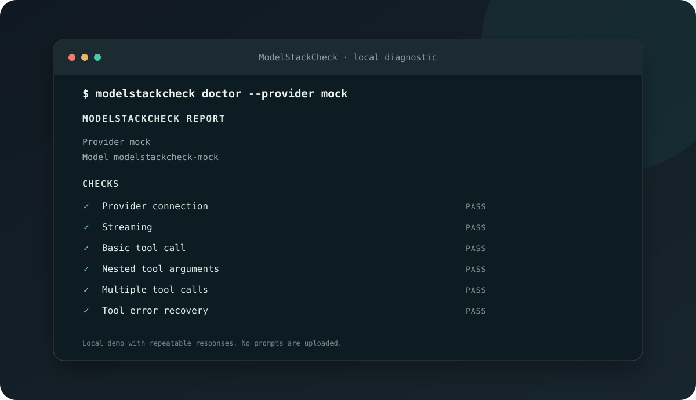

# ModelStackCheck


ModelStackCheck helps you find where a coding model setup breaks, and it points to the next useful check. It tests the provider directly, and it can send a read only fixture through OpenCode as well.



## Try it

Download [version 0.1.2 alpha](https://github.com/Praket7/modelstackcheck/releases/tag/v0.1.2-alpha) for your computer, and run a private demo with no model account.

```sh
modelstackcheck doctor --provider mock
```

The mock provider is local and repeatable, so it lets you see the report before connecting a real model.

## What it checks

The quick check tests the provider connection and streaming, and then checks basic and nested tool calls. It also tests multiple calls and recovery after a tool error, so you can see where common failures begin.

Add `--harness opencode` to run a read only fixture through the installed OpenCode command. ModelStackCheck creates a temporary project, reads one fixture file, and removes the project afterward.

Add `--profile context` to test retrieval at about 8K and 32K tokens. These sizes are estimates based on four characters per token, and the large request may use more tokens with a hosted provider.

Add `--profile vision` to send a generated red image and check whether the model identifies it. Add `--profile full` to run both context and image checks.

```sh
modelstackcheck doctor --harness opencode --profile full
```

ModelStackCheck sends prompts to the provider you select, but it does not save them. Review reports before sharing, and remember that a successful probe covers only the tested request.

## Connect a provider

Ollama is detected at its usual local address, and other OpenAI compatible services use these environment settings.

```sh
export OPENAI_BASE_URL=https://api.example.com/v1
export OPENAI_API_KEY=your-key
export OPENAI_MODEL=your-model
modelstackcheck doctor
```

## Read or save a report

Reports can be shown in the terminal, or saved as JSON and Markdown. Keys, email addresses, and home folder names are redacted from report text.

```sh
modelstackcheck doctor --format json --output report.json
modelstackcheck doctor --format markdown --output report.md
modelstackcheck diagnose report.json
```

## Apply a supported fix

ModelStackCheck previews a provider timeout change, and it applies the change only when you add `--apply`. The report must include an OpenCode timeout finding, and the original file is saved beside the config as a backup.

```sh
modelstackcheck fix --report report.json --config opencode.json --provider ollama
modelstackcheck fix --report report.json --config opencode.json --provider ollama --apply
```

Fixes support standard JSON configuration files. JSON with comments is left untouched, and an existing backup is never overwritten.

## Current limits

This is an early alpha, so context sizes are estimates and the image check tests one simple generated image. The OpenCode check has been verified with a deterministic local provider, and real provider behavior can vary. The tool does not certify a model for every project, and it does not change files without the explicit apply option.

## Build from source

Install Go 1.27 or newer, and build the command from this folder.

```sh
go test ./...
go vet ./...
go build -o modelstackcheck ./cmd/modelstackcheck
```

## Project

ModelStackCheck is open source under the MIT license, and contributions are welcome. Read the [build notes](BUILD.md), [contribution guide](CONTRIBUTING.md), and [security policy](SECURITY.md) before sending a change.

The name passed a preliminary search across source repositories and package registries, but it still needs a formal trademark review before commercial use.
